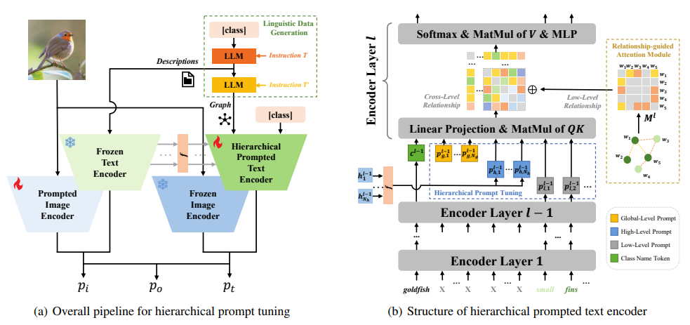

# Learning Hierarchical Prompt with Structured Linguistic Knowledge for Vision-Language Models (AAAI2024)


> [**Learning Hierarchical Prompt with Structured Linguistic Knowledge for Vision-Language Models**](https://arxiv.org/abs/2312.06323)<br>
> [Yubin Wang](https://scholar.google.com/citations?user=mLeYNLoAAAAJ), [Xinyang Jiang](https://scholar.google.com/citations?user=JiTfWVMAAAAJ), [De Cheng](https://scholar.google.com/citations?user=180lASkAAAAJ), [Dongsheng Li](https://scholar.google.com/citations?user=VNg5rA8AAAAJ), [Cairong Zhao](https://scholar.google.com/citations?user=z-XzWZcAAAAJ)

[](https://paperswithcode.com/sota/prompt-engineering-on-eurosat?p=learning-hierarchical-prompt-with-structured)

[](https://paperswithcode.com/sota/prompt-engineering-on-fgvc-aircraft?p=learning-hierarchical-prompt-with-structured)

[](https://paperswithcode.com/sota/prompt-engineering-on-imagenet-v2?p=learning-hierarchical-prompt-with-structured)

[](https://paperswithcode.com/sota/prompt-engineering-on-sun397?p=learning-hierarchical-prompt-with-structured)

[](https://paperswithcode.com/sota/prompt-engineering-on-ucf101?p=learning-hierarchical-prompt-with-structured)


Official implementation of the paper "[Learning Hierarchical Prompt with Structured Linguistic Knowledge for Vision-Language Models](https://arxiv.org/abs/2312.06323)".


<hr />

## 📢 News
* **(Dec 12, 2023)**
  - Training and evaluation codes for [HPT](https://github.com/Vill-Lab/2024-AAAI-HPT) are released 🔓
* **(Dec 09, 2023)**
  * Paper accepted at AAAI 2024 :tada: 

## ✨ Highlights


> **<p align="justify"> Abstract:** *Prompt learning has become a prevalent strategy for adapting vision-language foundation models to downstream tasks. As large language models (LLMs) have emerged, recent studies have explored the use of category-related descriptions as input to enhance prompt effectiveness. Nevertheless, conventional descriptions fall short of structured information that effectively represents the interconnections among entities or attributes linked to a particular category. To address this limitation and prioritize harnessing structured knowledge, this paper advocates for leveraging LLMs to build a graph for each description to model the entities and attributes describing the category, as well as their correlations. Preexisting prompt tuning methods exhibit inadequacies in managing this structured knowledge. Consequently, we propose a novel approach called Hierarchical Prompt Tuning (HPT), which enables simultaneous modeling of both structured and conventional linguistic knowledge. Specifically, we introduce a relationship-guided attention module to capture pair-wise associations among entities and attributes for low-level prompt learning. In addition, by incorporating high-level and globallevel prompts modeling overall semantics, the proposed hierarchical structure forges cross-level interlinks and empowers the model to handle more complex and long-term relationships. Extensive experiments demonstrate that our HPT shows strong effectiveness and generalizes much better than existing SOTA methods.* </p>

## :rocket: Contributions

- We raise the consideration that it is crucial to **use structured knowledge from descriptions** to assist learning prompts. Thus, we leverage large language models to generate category-related descriptions along with corresponding structured relationships; 
- We propose Hierarchical Prompt Tuning (HPT) for **simultaneously modeling both structured and conventional linguistic knowledge**. By incorporating both forms of knowledge, we can enhance prompt effectiveness with more category-related information;
- Extensive experiments are conducted on three commonly used evaluation settings. HPT outperforms existing approaches with a remarkable improvement.

## 📊 Results
### Base-to-New Generalization
Results reported below show average accuracy for base and new classes across 11 recognition datasets averaged over 3 seeds. Please refer to our paper for more numerical results

| Name                                       |   Base Accuracy   |   New Accuracy    |   Harmonic Mean   |
| ------------------------------------------ | :---------------: | :---------------: | :---------------: |
| [CLIP](https://arxiv.org/abs/2103.00020)   |       69.34       |       74.22       |       71.70       |
| [CoOp](https://arxiv.org/abs/2109.01134)   |       82.69       |       63.22       |       71.66       |
| [CoCoOp](https://arxiv.org/abs/2203.05557) |       80.47       |       71.69       |       75.83       |
| [MaPLe](https://arxiv.org/abs/2210.03117)  |       82.28       |       75.14       |       78.55       |
| [HPT](https://arxiv.org/abs/2312.06323)    | **84.32 (+2.04)** | **76.86 (+1.72)** | **80.23 (+1.68)** |

### Cross-Dataset Evaluation

Results reported below show accuracy for the source dataset **ImageNet** and 4 ImageNet-variant datasets averaged over 3 seeds.

|                                            |   ImNet   |  Caltech  |   Pets    |   Cars    |  Flowers  |   Food    | Aircraft  |  SUN397   |    DTD    |  EuroSAT  |    UCF    | *Average* |
| ------------------------------------------ | :-------: | :-------: | :-------: | :-------: | :-------: | :-------: | :-------: | :-------: | :-------: | :-------: | :-------: | :-------: |
| [CLIP](https://arxiv.org/abs/2103.00020)   |   71.51   |   93.70   |   89.14   |   64.51   |   68.71   |   85.30   |   18.47   |   64.15   |   41.92   |   46.39   |   66.55   |   63.88   |
| [CoCoOp](https://arxiv.org/abs/2203.05557) |   71.02   | **94.43** |   90.14   |   65.32   |   71.88   |   86.06   |   22.94   |   67.36   |   45.73   |   45.37   |   68.21   |   65.74   |
| [MaPLe](https://arxiv.org/abs/2210.03117)  |   70.72   |   93.53   |   90.49   |   65.57   |   72.23   |   86.20   |   24.74   |   67.01   |   46.49   | **48.06** |   68.69   |   66.30   |
| [HPT](https://arxiv.org/abs/2312.06323)    | **71.72** |   94.20   | **92.63** | **66.33** | **74.84** | **86.21** | **25.68** | **68.75** | **50.87** |   47.36   | **70.50** | **67.74** |

### Domain Generalization

Results reported below show accuracy for the source dataset **ImageNet** and the other 10 target datasets averaged over 3 seeds.

|                                            | ImageNet  | ImageNetV2 | ImageNet-S | ImageNet-A | ImageNet-R | *Average* |
| :----------------------------------------- | :-------: | :--------: | :--------: | :--------: | :--------: | :-------: |
| [CLIP](https://arxiv.org/abs/2103.00020)   |   66.73   |   60.83    |   46.15    |   47.77    |   73.96    |   57.17   |
| [CoOp](https://arxiv.org/abs/2109.01134)   |   71.51   |   64.20    |   47.99    |   49.71    |   75.21    |   59.28   |
| [CoCoOp](https://arxiv.org/abs/2203.05557) |   71.02   |   64.07    |   48.75    |   50.63    |   76.18    |   59.90   |
| [MaPLe](https://arxiv.org/abs/2210.03117)  |   70.72   |   64.07    |   49.15    | **50.90**  |   76.98    |   60.26   |
| [HPT](https://arxiv.org/abs/2312.06323)    | **71.72** | **65.25**  | **49.36**  |   50.85    | **77.38**  | **60.71** |

## 🛠️ Installation 

For installation and other package requirements, please follow the instructions detailed in [INSTALL.md](docs/INSTALL.md). 

## 🗂️ Data preparation
Please follow the instructions at [DATASETS.md](docs/DATASETS.md) to prepare all datasets.


## 🧪 Training and Evaluation
Please refer to [RUN.md](docs/RUN.md) for detailed instructions on training and evaluating.

## 🔍 Citation
If you use our work, please consider citing:

```bibtex
@misc{wang2023learning,
      title={Learning Hierarchical Prompt with Structured Linguistic Knowledge for Vision-Language Models}, 
      author={Yubin Wang and Xinyang Jiang and De Cheng and Dongsheng Li and Cairong Zhao},
      year={2023},
      eprint={2312.06323},
      archivePrefix={arXiv},
      primaryClass={cs.CV}
}
```

## 📧 Contact
If you have any questions, please create an issue on this repository or contact us at wangyubin2018@tongji.edu.cn or zhaocairong@tongji.edu.cn.


## 😃 Acknowledgments

Our code is based on [CoCoOp and CoOp](https://github.com/KaiyangZhou/CoOp) repository. We thank the authors for releasing their code. If you use our model and code, please consider citing these works as well.

